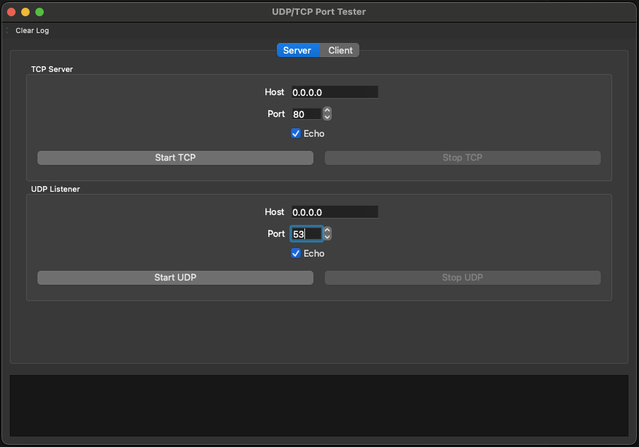
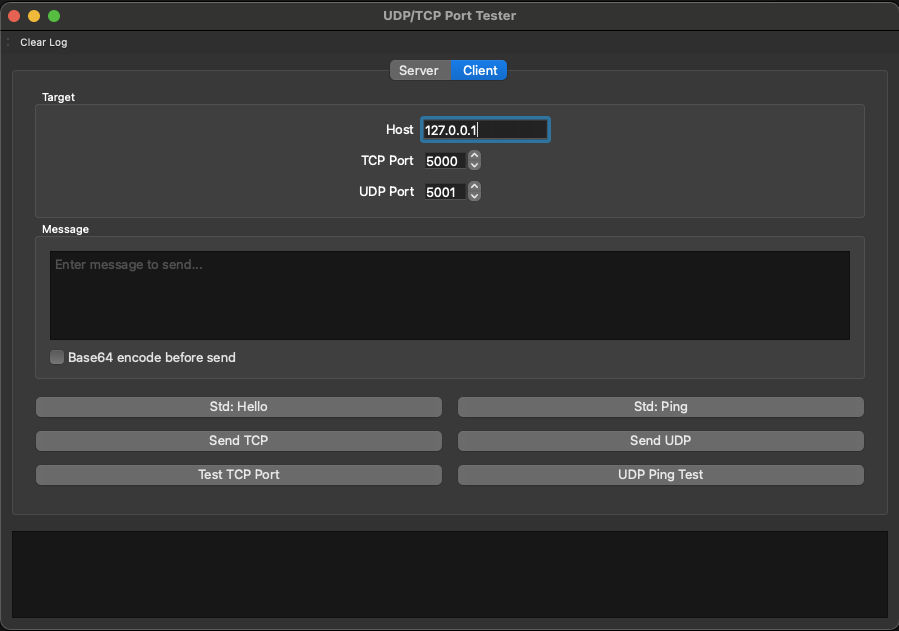

# UDP/TCP Port Tester GUI

<!-- Badges -->
[

](https://github.com/Nitecon/port-tester/actions/workflows/ci.yml)
[

](https://github.com/Nitecon/port-tester/releases)


[](./LICENSE)

A simple Qt (PySide6) desktop app to test UDP and TCP ports in multiplayer/networked scenarios.

## Quick links

- **Latest Releases**: https://github.com/Nitecon/port-tester/releases
- **CI Runs**: https://github.com/Nitecon/port-tester/actions

### Server tab

The Server tab lets you run a TCP server and a UDP listener with optional echo. Use this to receive data and validate open ports locally or across the network.



### Client tab

The Client tab lets you target a host and ports, send standard or custom messages (optionally Base64-encoded), and run quick port tests (TCP connect and UDP ping).



## Features

- Server tab
  - TCP server: listen, accept, log messages, optional echo.
  - UDP listener: bind, log datagrams, optional echo.
  - Live logs.
- Client tab
  - Send standard messages (Hello, Ping) or custom text.
  - Optional Base64-encode before sending.
  - Send via TCP or UDP to a target host:port.
  - TCP connect test (port open check).
  - UDP ping test (send and wait for reply with timeout).

## Requirements

- Python 3.10+
- macOS (tested). Should work on Linux/Windows with Python and Qt dependencies installed.

## Create a virtual environment and install requirements

Use your installed Python (often `python3` on macOS/Linux):

```bash
# Create and activate a venv
python3 -m venv venv
source venv/bin/activate

# Upgrade packaging tools (recommended)
python -m pip install --upgrade pip wheel setuptools

# Install dependencies
python -m pip install -r requirements.txt
```

Windows (PowerShell) example:

```powershell
python -m venv venv
./venv/Scripts/Activate.ps1
python -m pip install --upgrade pip wheel setuptools
python -m pip install -r requirements.txt
```

## Run the application

```bash
python app.py
```

## How the UI works

The main window has two tabs and a log pane at the bottom.

- **Server tab**
  - **TCP Server**
    - Host: interface to bind (e.g., `0.0.0.0` to accept from LAN, `127.0.0.1` for local only).
    - Port: TCP port number to listen on (default 5000).
    - Echo: when enabled, the server replies with the same bytes received.
    - Start/Stop: controls the TCP listener. Connections and messages are logged below.
  - **UDP Listener**
    - Host: interface to bind (e.g., `0.0.0.0` or `127.0.0.1`).
    - Port: UDP port number to listen on (default 5001).
    - Echo: when enabled, replies to the sender with the same datagram.
    - Start/Stop: controls the UDP socket. Incoming datagrams are logged.

- **Client tab**
  - **Target**
    - Host: the remote host to contact (`127.0.0.1` for local machine, or LAN IP).
    - TCP Port and UDP Port: destination ports.
  - **Message**
    - Enter custom text, or click a standard message button (Hello/Ping).
    - Enable "Base64 encode before send" to send base64-encoded bytes.
  - **Actions**
    - Send TCP: sends the message over TCP and displays any echo received.
    - Send UDP: sends a datagram; no reply is expected by default.
    - Test TCP Port: attempts a TCP connect with timeout to report OPEN/CLOSED.
    - UDP Ping Test: sends "ping" and waits briefly for a reply. Use the Server tab's UDP Listener with Echo enabled (or another responder) on the target to receive a reply.

## Multiplayer/LAN usage

1. On the server machine, open the Server tab.
2. Set Host to `0.0.0.0` and choose ports (e.g., TCP 5000, UDP 5001). Enable Echo if desired.
3. Click Start TCP and/or Start UDP.
4. On a client machine, open the Client tab and set Host to the server's LAN IP and matching ports.
5. Use Send/Test buttons. Ensure OS/firewall allows inbound TCP/UDP on chosen ports.

## Notes

- For UDP ping test to receive a reply, run the UDP listener with Echo enabled on the target host/port, or another process that replies.
- For TCP testing, the TCP server in the Server tab can echo back data if Echo is enabled.
